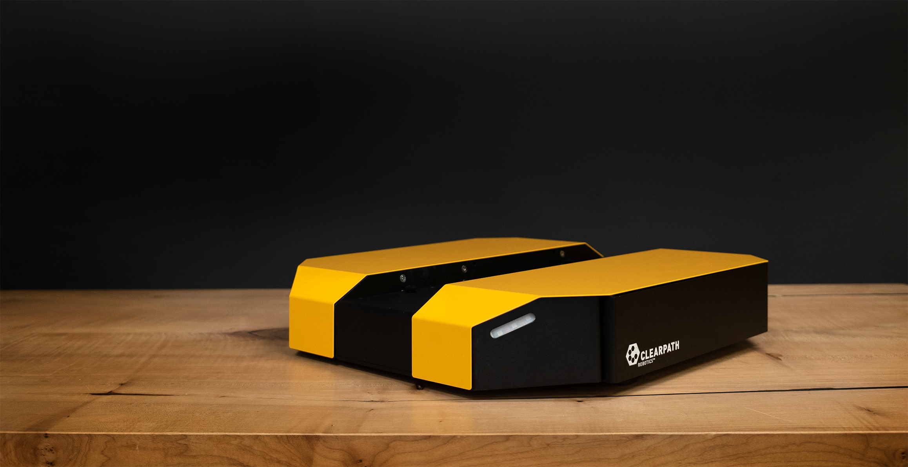

PLATFORM Tutorials
===================

This package supplies Sphinx-based tutorial content to assist you with setting up and operating your PLATFORM_ mobile robot. The tutorials topics are listed in the left column, and presented in the suggested reading order.

.. _PLATFORM: https://clearpathrobotics.com/PLATFORM-indoor-mobile-robot/

.. Warning::
  These tutorials assume that you are comfortable working with ROS. We recommend starting with our
  `ROS tutorial <./../ros>`_ if you are not familiar with ROS already.

:doc:`Simulation <Simulating>` is a logical place for most users to start, as this is universally applicable; understanding how to effectively operate PLATFORM in simulation is valuable whether you are in the testing phase with software you intend to ultimately deploy on a real PLATFORM, or you do not have one and are simply exploring the platform's capabilities.

:doc:`Driving <Driving>` covers how to teleoperate PLATFORM using the remote control, a well as safety procedures for operating the real robot. Anyone working with a physical robot should be familiar with this section.

:doc:`Navigation <Navigating>` is a follow-on to what is learned in the simulation tutorial, as navigation and map-making may be run in the simulated environment. However, this content is applicable to both the simulator and the real platform, if equipped with a laser scanner.

.. toctree::
    :maxdepth: 0
    :caption: PLATFORM Overview

    Introduction <self>
    Details
    ROSTopics
    StatusIndicators
    EnvironmentVariables

.. toctree::
    :maxdepth: 0
    :caption: PLATFORM ROS Packages

    CommonPackages
    DescriptionPackage

.. toctree::
    :maxdepth: 0
    :caption: Setting Up PLATFORM

    Installing
    Networking
    PairingController
    CalibratingCompass

.. toctree::
    :maxdepth: 0
    :caption: Using PLATFORM

    Driving
    Simulating
    Navigating
    ExtendingStartup
    KeepingUpdated

.. toctree::
    :maxdepth: 0
    :caption: Hardware Customization

    CustomComputer
    Payloads
    Manipulation

.. toctree::
    :maxdepth: 0
    :caption: PLATFORM On Windows

.. toctree::
    :titlesonly:
    :maxdepth: 0
    :caption: NVIDIA Jetson

    JetsonNano
    JetsonXavier

.. toctree::
    :titlesonly:
    :hidden:
    :caption: Other

    AdditionalSimulation
